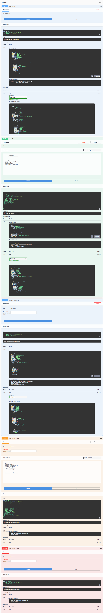
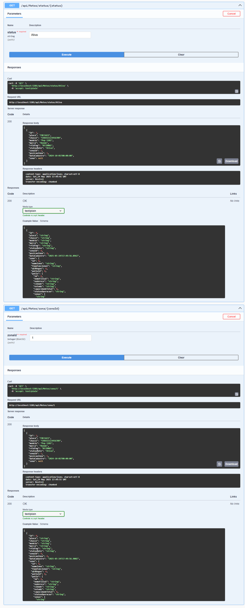
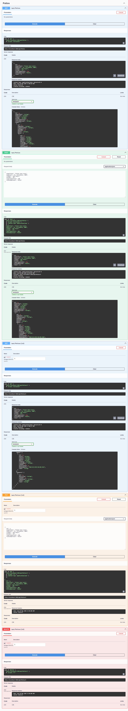
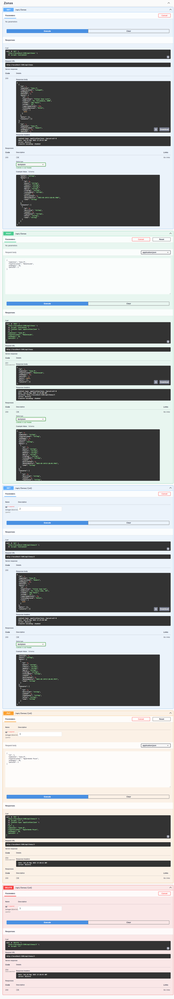
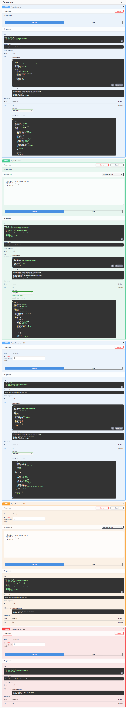
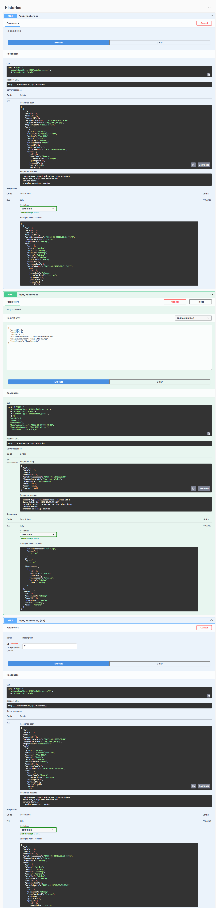
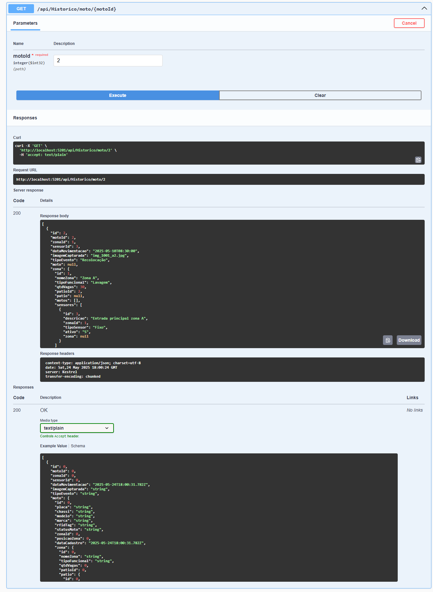

# 📘 Projeto Challenge — Mapeamento Inteligente de Pátios da Mottu

---

## 👨‍💻 **Integrantes**

| Nome                  | RM       |
| --------------------  | -------- |
| Luiz Sadao Kamada     | RM556762 |
| Eduardo Guilherme Dia | RM557886 |
| Gabriel Alves Thomaz  | RM558637 |

---

## 🧠 **Descrição do Projeto**

> Este sistema faz parte do *Challenge 2025 da FIAP* em parceria com a Mottu.
> Foi desenvolvido para resolver o problema da **localização e rastreamento de motos em pátios logísticos** por meio de uma **API RESTful em ASP.NET Core**, integrada com banco Oracle, sensores RFID e visão computacional.

---

## 🛠️ **Tecnologias Utilizadas**

* ⚙️ ASP.NET Core 7.0
* 🗃️ Entity Framework Core (EF Core)
* 🧬 Oracle Database
* 📑 Swagger / OpenAPI
* 💻 Visual Studio 2022
* 🐙 Git + GitHub

---

## 🚀 **Instalação e Execução**

### ✅ Pré-requisitos

* .NET SDK 7.0+
* Oracle Database (local ou nuvem)
* Git + Visual Studio ou VS Code

### ▶️ Passos para executar:

```bash
git clone https://github.com/seu-usuario/challenge-api.git
cd challenge-api
```

1. Configure a connection string no `appsettings.json`:

```json
"ConnectionStrings": {
  "OracleDB": "Data Source=localhost:1521/XEPDB1;User Id=admin;Password=admin"
}
```

2. Crie as tabelas com migrations:

```bash
dotnet ef database update
```

3. Rode a aplicação:

```bash
dotnet run
```

4. Acesse no navegador:
   `http://localhost:5201/swagger`

---

## 🔀 **Rotas da API**

## Pagina Swagger


### 📦 **/api/motos**

* `GET /api/motos` → Lista todas as motos
* `GET /api/motos/{id}` → Retorna uma moto específica
* `GET /api/motos/status/{status}` → Lista motos por status (ex: Ativa)
* `GET /api/motos/zona/{zonaId}` → Lista motos de uma zona específica
* `POST /api/motos` → Cadastra uma nova moto
* `PUT /api/motos/{id}` → Atualiza uma moto existente
* `DELETE /api/motos/{id}` → Remove uma moto



---

### 🏢 **/api/patios**

* `GET /api/patios` → Lista todos os pátios
* `GET /api/patios/{id}` → Retorna um pátio específico
* `POST /api/patios` → Cadastra um novo pátio
* `PUT /api/patios/{id}` → Atualiza um pátio
* `DELETE /api/patios/{id}` → Remove um pátio


---

### 🧭 **/api/zonas**

* `GET /api/zonas` → Lista todas as zonas
* `GET /api/zonas/{id}` → Retorna uma zona específica
* `POST /api/zonas` → Cadastra nova zona
* `PUT /api/zonas/{id}` → Atualiza uma zona
* `DELETE /api/zonas/{id}` → Remove uma zona


---

### 📡 **/api/sensores**

* `GET /api/sensores` → Lista todos os sensores RFID
* `GET /api/sensores/{id}` → Retorna um sensor específico
* `POST /api/sensores` → Cadastra um novo sensor
* `PUT /api/sensores/{id}` → Atualiza um sensor
* `DELETE /api/sensores/{id}` → Remove um sensor


---

### 🕑 **/api/historico**

* `GET /api/historico` → Lista todos os eventos de movimentação
* `GET /api/historico/{id}` → Retorna um histórico específico
* `GET /api/historico/moto/{motoId}` → Lista históricos por moto
* `POST /api/historico` → Cria novo registro de movimentação



---

## 📄 **Licença**

Projeto acadêmico da FIAP para o Challenge 2025.
Todos os direitos reservados ao grupo desenvolvedor.

---
